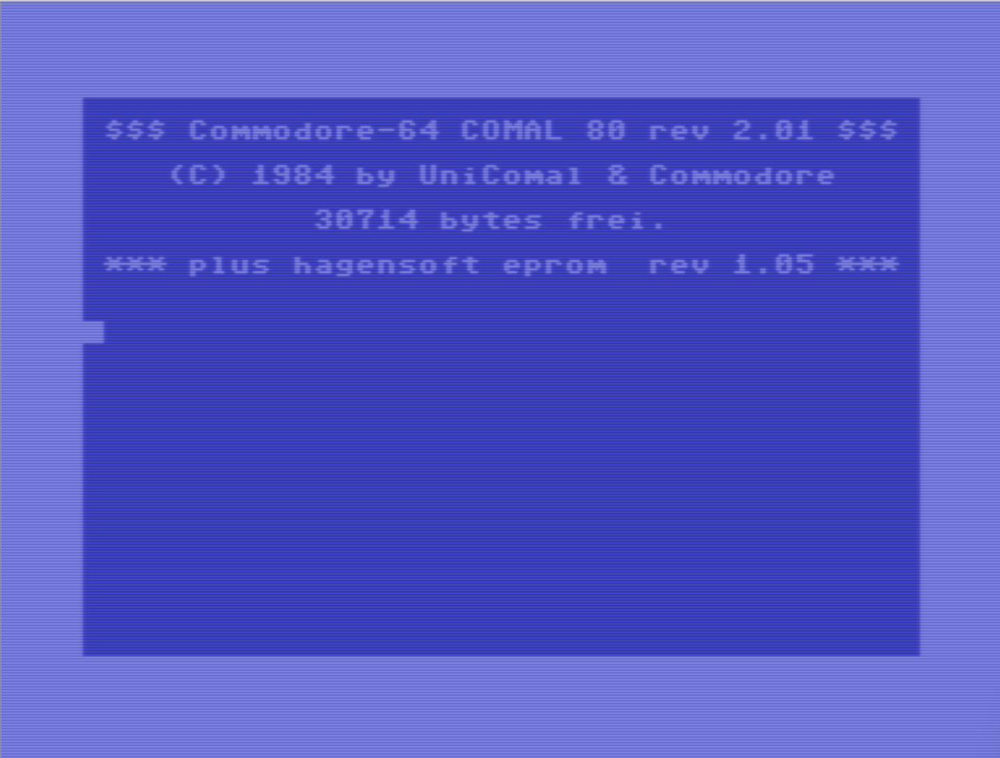
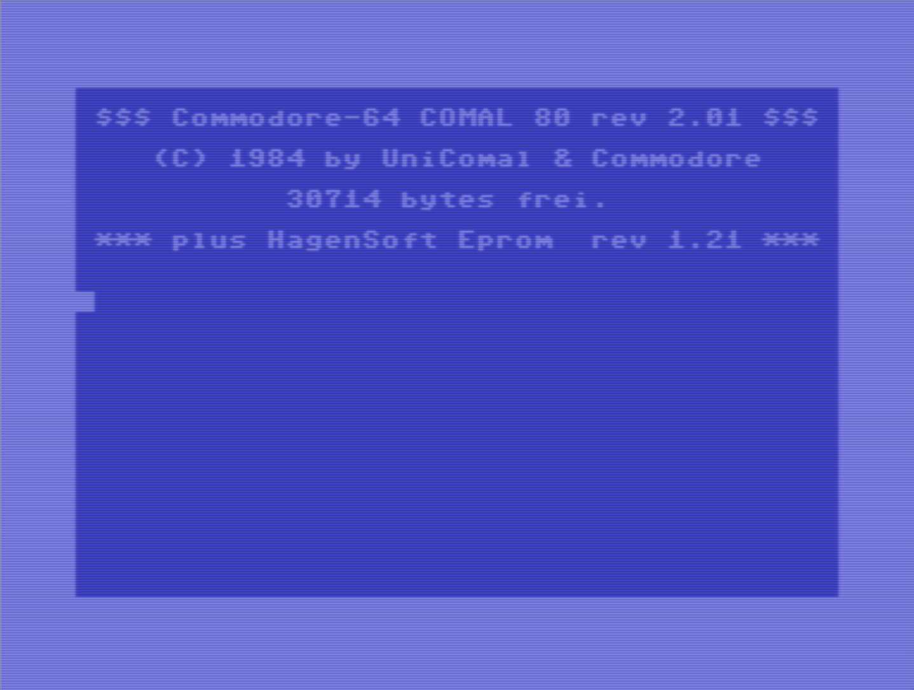

# C64 COMAL Hagensoft Erweiterung

> Rekonstruierter Quell-Code der originalen **Hagensoft-Erweiterung**
> für **COMAL80 Revision 2.01** auf dem Commodore 64 und Commodore 128.

------------------------------------------------------------------------

## Überblick

Hagensoft ist eine ROM-Erweiterung für das originale **COMAL80 Revision
2.01**-Modul.

Dieses Repository enthält den rekonstruierten Quell-Code der originalen
Hagensoft-Erweiterung für den Commodore 64 und Commodore 128.

Ziel dieses Projekts ist es, die ursprüngliche Hagensoft-Erweiterung zu
erhalten und gleichzeitig eine solide Grundlage für die Entwicklung
eigener COMAL80-Erweiterungen bereitzustellen.

------------------------------------------------------------------------

## Eigenschaften

-   Rekonstruierter originaler Quell-Code
-   Unterstützung für Hagensoft Revision **1.05**
-   Unterstützung für Hagensoft Revision **1.21**
-   Binär identische ROM-Images
-   Build-System auf Basis des ACME Cross Assemblers
-   Erzeugung von `.bin`- und `.chip`-Dateien

------------------------------------------------------------------------

## Projektstruktur

``` text
assets/     Screenshots
build/      Erzeugte Dateien
code/       Quell-Code
scripts/    Build-Skripte
```

------------------------------------------------------------------------

## Hagensoft für COMAL80

Hagensoft ist eine Erweiterung für das originale **COMAL80 Revision
2.01**-Modul und kann daher **nicht als eigenständiges Cartridge**
verwendet werden.

Unterstützte Versionen:

-   **Revision 1.05**
-   **Revision 1.21**

------------------------------------------------------------------------

## Screenshots

<div align="left">
<table border="0" cellpadding="6" width="600">
<tr>
<td align="center"></td>
<td align="center"></td>
</tr>
</table>
</div>

------------------------------------------------------------------------

## Erstellen (Build)

Das Projekt wird mit dem **ACME Cross Assembler** assembliert.

### Konfiguration

``` sh
cp scripts/config.sh.example scripts/config.sh
```

Anschließend `scripts/config.sh` anpassen:

-   Pfad zum ACME Cross Assembler
-   gewünschte Hagensoft-Version (`105` oder `121`)

Beispiel:

``` sh
ACME="acme"
HSOFT=121
```

### Build

``` sh
sh scripts/build.sh
```

Die erzeugten Dateien werden im Verzeichnis `build` abgelegt:

-   `hagensoft_105.bin`
-   `hagensoft_105.chip`
-   `hagensoft_121.bin`
-   `hagensoft_121.chip`

Die `.bin`-Datei enthält das reine 8-KB-ROM-Image.

Die `.chip`-Datei enthält dasselbe ROM-Image mit einem VICE-kompatiblen
CHIP-Header.

------------------------------------------------------------------------

## Informationen zu COMAL80

Weitere Informationen zu COMAL80:

-   https://www.c64-wiki.de/wiki/Commodore-64_Comal_80_rev_2.01
-   https://www.c64-wiki.com/wiki/Commodore-64_Comal_80_rev_2.01

Informationen über den Aufbau von COMAL-Erweiterungen:

-   https://archive.org/details/comal-80-for-the-commodore-64/page/n255/mode/2up

## Hagensoft Revision 1.05

Version **1.05** erweitert COMAL80 um drei zusätzliche Pakete:

1.  **DEUTSCH**
2.  **MATRIX**
3.  **DUMP802**

### DEUTSCH

Das originale COMAL80-Modul enthält Fehlermeldungen in den Sprachen
**DANSK** und **ENGLISH**.

Die Hagensoft-Erweiterung ergänzt das Sprachpaket **DEUTSCH**, das nach
dem Start standardmäßig aktiviert ist.

Mit dem Befehl

``` text
USE <Sprache>
```

kann jederzeit zwischen den installierten Sprachpaketen umgeschaltet
werden.

### MATRIX

Aktivierung:

``` text
USE MATRIX
```

Zusätzliche Befehle:

``` text
MATPUT
MATADD
MATSUB
MATCOM
MATNULL
MATUNIT
MATMULT
MATTRANS
DEMAT
NULLMAT
EQMAT
```

Die Funktionsweise dieser Befehle wurde bislang nicht näher untersucht.

### DUMP802

Aktivierung:

``` text
USE DUMP802
```

Enthaltene Befehle:

``` text
DUMP
MEMORY
PALETTE
```

Auch diese Befehle wurden bislang nicht näher untersucht.

------------------------------------------------------------------------

## Hagensoft Revision 1.21

Revision **1.21** erweitert das Paket **DUMP802** und ergänzt ein
viertes Paket mit dem Namen **HAGENSOFT**.

Aktivierung:

``` text
USE HAGENSOFT
```

Die Befehle **MEMORY** und **PALETTE** wurden aus **DUMP802** in das
neue Paket **HAGENSOFT** übernommen.

Zusätzliche Befehle:

``` text
MEMORY
PALETTE
EDGE
SYMBOLS
GETSHAPE
BDRAW
ELLIPSE
LEARN
EVAL
EXECUTE
```

Wie bereits bei Revision 1.05 ist es **nicht** Ziel dieses Projekts, die
einzelnen Befehle oder ihre Funktionsweise zu dokumentieren.

------------------------------------------------------------------------

## Quell-Code

Der Quell-Code wurde anhand originaler Hagensoft-ROMs rekonstruiert,
die frei im Internet verfügbar sind.

Die daraus erzeugten ROM-Images wurden mit den Original-ROMs verglichen
und sind **binär identisch**.

Der Quell-Code ist derzeit noch größtenteils undokumentiert. An
geeigneten Stellen wurden jedoch bereits Kommentare ergänzt.

------------------------------------------------------------------------

## Entwicklung

Das Projekt wird mit dem **ACME Cross Assembler** assembliert.

Das Build-System befindet sich im Verzeichnis `scripts`.

Die erzeugten Dateien werden im Verzeichnis `build` abgelegt.

------------------------------------------------------------------------

## Lizenz / Hinweis

Dieser rekonstruierte Quell-Code wird zu Dokumentations-,
Archivierungs- und Ausbildungszwecken bereitgestellt.

Die Benutzung erfolgt auf eigene Gefahr.
